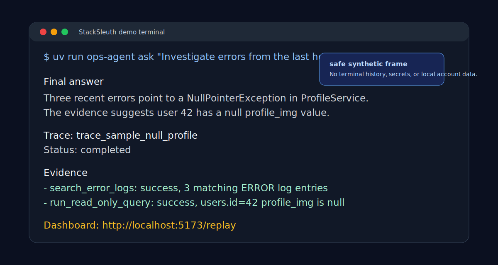
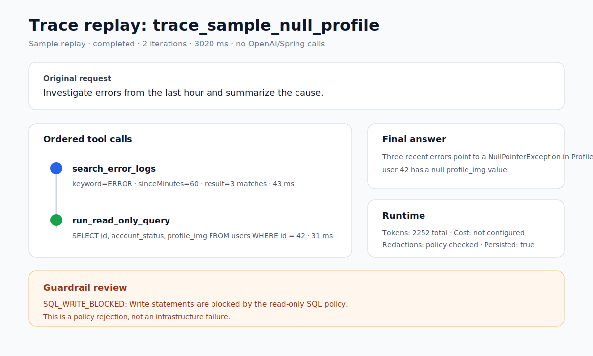
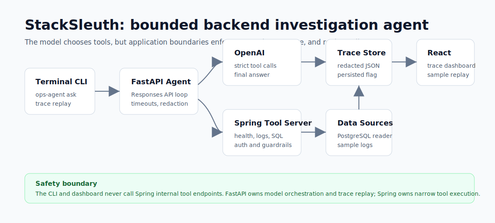
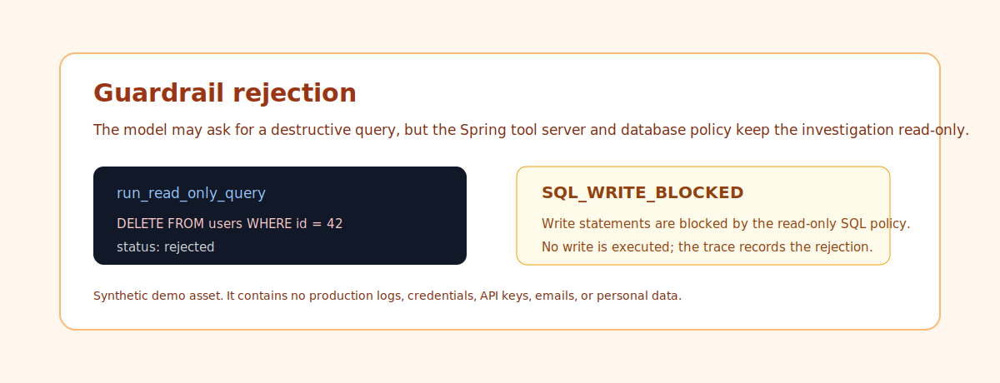

# StackSleuth

StackSleuth is a portfolio-grade reference implementation for Java/Spring backend developers who want to demonstrate production-minded OpenAI tool calling.

The project concept is simple: a developer types an operations question in a terminal, and an AI agent investigates the backend by safely calling approved Spring Boot tools such as server health checks, error-log search, and read-only SQL inspection. A web dashboard then visualizes the agent trace so engineers can inspect tool calls, guardrail decisions, latency, token usage, and final evidence. The goal is not to build another chatbot. The goal is to show how to delegate bounded backend investigation work to an AI agent with guardrails, auditability, and developer-friendly documentation.



## Positioning

**One-line pitch:** An agentic ops copilot for backend tool calling.

**Current status:** MVP implementation is code-complete for the local portfolio demo. The Spring Boot tool server, deterministic PostgreSQL demo data, bounded Python agent service, terminal CLI, React trace dashboard, and deterministic eval scenarios are implemented. A live OpenAI run is supported when credentials are configured, but live model quality is not claimed as checked-in automated evidence.

**What this demonstrates:**

- OpenAI Responses API tool calling and agent loop design
- Spring Boot as a secure backend tool server
- Python FastAPI as a lightweight OpenAI orchestration service
- Vite + React as an agent observability and replay dashboard
- SQL safety controls, max-iteration limits, timeout handling, and audit logs
- AI-assisted frontend development with human-reviewed DX, state handling, and trace readability
- Developer experience artifacts: quickstart, diagrams, demo scenarios, failure cases, trace dashboard, and design rationale

## Demo Evidence

The checked-in demo assets are sanitized synthetic frames derived from the sample trace and documented CLI output. They are intentionally not raw terminal or desktop recordings, so they do not expose `.env`, local account names, terminal history, API keys, database passwords, or private logs.

| Asset | Purpose |
| --- | --- |
| [Terminal demo frame](docs/assets/terminal-demo.svg) | Shows the `ops-agent ask` happy path output shape |
| [Trace dashboard screenshot](docs/assets/dashboard-replay.svg) | Shows replay, tool timeline, evidence, metrics, and guardrail review |
| [Guardrail rejection screenshot](docs/assets/guardrail-rejection.svg) | Shows `SQL_WRITE_BLOCKED` as a policy rejection |
| [Architecture diagram](docs/assets/architecture.svg) | Shows CLI, FastAPI, OpenAI, Spring, data sources, trace store, and dashboard boundaries |



## Architecture



The CLI and dashboard never call Spring internal tool endpoints. FastAPI owns model orchestration, tool routing, redaction, and trace persistence. Spring owns narrow backend tool execution, authentication, SQL policy, and database access.

## Guardrail Example



The SQL tool accepts only bounded read-only investigation queries. Destructive
statements are rejected as `SQL_WRITE_BLOCKED`, recorded separately from
infrastructure failures, and shown in the CLI/dashboard trace instead of being
executed.

## Documents

- [Project Brief](docs/PROJECT_BRIEF.md)
- [Architecture](docs/ARCHITECTURE.md)
- [Development Plan](docs/DEVELOPMENT_PLAN.md)
- [Frontend Dashboard Plan](docs/FRONTEND_DASHBOARD.md)
- [Demo Script](docs/DEMO_SCRIPT.md)
- [Submission Checklist](docs/SUBMISSION_CHECKLIST.md)
- [Skills and Docs Checklist](docs/SKILLS_AND_DOCS.md)
- [Beginner Tutorial](docs/TUTORIAL.md)
- [Developer Experience Content Strategy](docs/CONTENT_STRATEGY.md)
- [Build Log](docs/BUILD_LOG.md)
- [Korean Article Series with English Summaries](docs/articles/README.md)

## Current Quickstart

The implemented backend flow can be verified without an OpenAI API key:

```bash
cp .env.example .env
./gradlew :spring-tool-server:test
cd python-agent-service
uv sync --locked --all-groups
uv run pytest -q
uv run python ../examples/python-agent/mock_investigation.py
uv run python ../evals/run_evals.py
```

Expected result:

- Spring tests verify internal authentication, bounded tools, and SQL policy.
- Python tests exercise mocked OpenAI and Spring calls, timeout boundaries,
  trace redaction, and HTTP replay.
- The mock example prints a completed investigation trace without credentials.
- Deterministic eval scenarios verify the happy path, SQL guardrail rejection,
  tool timeout handling, and max-iteration stopping without OpenAI or Spring.

The terminal entry point is implemented:

```bash
uv run ops-agent ask "최근 1시간 에러 분석해줘" --open-trace
```

The command calls the FastAPI agent service, prints the final answer first,
shows compact evidence and the trace ID, and prints the dashboard trace URL
when `--open-trace` is set.

The trace dashboard can be verified without an OpenAI API key:

```bash
cd web-dashboard
npm ci
npm run lint
npm test
npm run build
npm run test:e2e
npm run dev
```

Open `http://localhost:5173/replay` to inspect the bundled sample trace. Replay
mode renders checked-in trace data and does not call OpenAI, Spring, or FastAPI.

## Implementation Status

| Area | Status |
| --- | --- |
| Product brief | Documented |
| Architecture | Documented |
| Spring Boot tool server | Initial implementation complete: internal auth, health tool, log-search endpoint, database-backed read-only SQL, audit sink, and tests |
| PostgreSQL demo data | Implemented: Docker Compose, deterministic fixtures, correlated sample logs, and database-enforced read-only role |
| Python FastAPI agent service | Initial implementation complete: Responses API loop, strict tools, bounded execution, structured Spring errors, redacted local traces, API endpoints, and tests |
| CLI | Initial implementation complete: `ask`, `--verbose`, `--open-trace`, `trace show`, `trace replay`, structured API errors, and tests |
| React trace dashboard | Initial implementation complete: `/traces`, `/traces/{traceId}`, `/replay`, component tests, Playwright replay smoke test, and sample trace |
| Evals and guardrail scenarios | Initial implementation complete: deterministic `evals/scenarios.yml`, runner, CI hook, and tests for happy path, SQL rejection, tool timeout, and max-iteration stop |
| Demo and trace-replay assets | Sanitized static demo frames, architecture diagram, sample trace, and guardrail screenshot implemented; externally recorded GIF/video still planned |
| Beginner tutorial and DX content program | Tutorial, build log, content strategy, and Korean article drafts implemented; external publication evidence is still planned |

## Planned but Not Claimed

- External blog publication URLs are not added until the posts are actually published.
- A polished terminal GIF or video recording is still a publication task; checked-in visual assets are sanitized static frames.
- Live OpenAI model quality is not part of CI because model choice and credentials are user-specific.
- Production deployment, multi-tenant auth, retention policy, and external trace storage are outside the MVP scope.

## Spring Tool Server

The Spring Boot tool server lives in `spring-tool-server`.

Run the server tests:

```bash
./gradlew :spring-tool-server:test
```

Create a local `.env`, set both database passwords, and start PostgreSQL:

```bash
cp .env.example .env
docker compose --env-file .env -f infra/docker-compose.yml up -d --wait
set -a
source .env
set +a
infra/scripts/verify-postgres.sh
```

Run the server locally with the same environment loaded:

```bash
./gradlew :spring-tool-server:bootRun
```

The example `.env` fixes the tool-server clock at `2026-06-24T03:00:00Z` so the checked-in incident remains inside a deterministic 60-minute demo window. Clear `TOOL_SERVER_CLOCK_INSTANT` to use the real UTC clock.

Check the health tool:

```bash
curl -X POST http://localhost:8080/internal/tools/health \
  -H 'Content-Type: application/json' \
  -H 'X-Tool-Server-Token: local-dev-token' \
  -d '{"includeJvm":true,"includeDbPool":true}'
```

The SQL endpoint applies parser-based read-only guardrails before executing through the restricted `TOOL_DB_USER` account. If `TOOL_DB_ENABLED` is false, it returns a structured `database_not_configured` response without attempting a connection.

Verify the seeded null-profile incident:

```bash
curl -X POST http://localhost:8080/internal/tools/sql/read-only \
  -H 'Content-Type: application/json' \
  -H "X-Tool-Server-Token: ${TOOL_SERVER_TOKEN}" \
  -d '{"sql":"SELECT id, account_status, profile_img FROM users WHERE id = 42"}'
```

## Python Agent Service

The FastAPI service lives in `python-agent-service`. It uses an explicit
Responses API loop rather than hiding orchestration inside a framework:

```bash
cd python-agent-service
uv sync --locked --all-groups
uv run ruff check .
uv run pytest -q --cov=app --cov-report=term-missing
uv run python ../examples/python-agent/mock_investigation.py
uv run python ../evals/run_evals.py
```

For a live investigation, start the Spring server, set `OPENAI_API_KEY`,
`AGENT_MODEL`, and `TOOL_SERVER_TOKEN` in the untracked `.env`, then run:

```bash
set -a
source ../.env
set +a
uv run uvicorn app.main:app --reload --port 8000
```

In another terminal:

```bash
curl -X POST http://localhost:8000/agent/run \
  -H 'Content-Type: application/json' \
  -d '{"request":"Investigate errors from the last hour and summarize the evidence."}'
```

Replay the returned trace without another OpenAI or Spring call:

```bash
curl http://localhost:8000/agent/traces/<trace_id>
```

See the [agent-service guide](python-agent-service/README.md) and
[beginner tutorial](docs/TUTORIAL.md) for boundaries and current limitations.

## Terminal CLI

The `ops-agent` CLI is packaged with the Python agent service and talks only to
FastAPI:

```bash
cd python-agent-service
uv sync --locked --all-groups
uv run ops-agent ask "Investigate errors from the last hour" --verbose
uv run ops-agent trace show <trace_id>
uv run ops-agent trace replay <trace_id>
```

Configure alternate local endpoints with:

```bash
export STACKSLEUTH_AGENT_URL=http://localhost:8000
export STACKSLEUTH_DASHBOARD_URL=http://localhost:5173
```

The CLI does not call Spring internal tool endpoints. Replay loads a persisted
trace through `GET /agent/traces/{traceId}` and does not call OpenAI or Spring.

## React Trace Dashboard

The dashboard lives in `web-dashboard` and is an observability surface, not a
chat interface:

```bash
cd web-dashboard
npm ci
npm run dev
```

Open:

```text
http://localhost:5173/replay
```

For persisted traces, start the FastAPI service and open:

```text
http://localhost:5173/traces/<trace_id>
```

The dashboard calls only `GET /agent/traces/{traceId}`. `/replay` uses bundled
sample trace data from the web app, with the canonical JSON fixture stored at
`examples/traces/null-profile-image.json`.

## Intended Audience

This repository is designed for:

- OpenAI Developer Experience / AI Deployment Engineer portfolio review
- Java Spring backend engineers learning agentic tool calling
- Teams exploring safe AI access to internal tools
- Future open-source contributors who want a practical agent backend template

## Official OpenAI References

- Responses API: https://developers.openai.com/api/reference/resources/responses/methods/create
- Function calling: https://developers.openai.com/api/docs/guides/function-calling
- Agents SDK: https://developers.openai.com/api/docs/guides/agents
- Safety best practices: https://developers.openai.com/api/docs/guides/safety-best-practices
- Production best practices: https://developers.openai.com/api/docs/guides/production-best-practices
